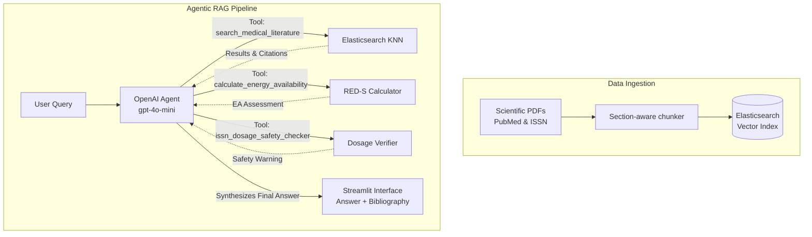

# Athletica 🏋️‍♀️

> Evidence-based nutrition, training, and physiology assistant for female athletes

[](https://github.com/DataTalksClub/llm-zoomcamp)
[]()
[]()

Literature on fitness and nutrition has historically been dominated by male-centric research, which means that translating these findings directly onto the female body often results in suboptimal, or even counterproductive, recommendations. For example, intermittent fasting has been widely championed as an effective strategy for men, but the hormonal environment of women — particularly the sensitivity of the hypothalamic-pituitary-ovarian axis to energy restriction — can make it, in general terms, a detrimental strategy for female recreational or professional athletes, increasing the risk of menstrual dysfunction and low energy availability. With the aim of closing this gap and giving women access to evidence-based, physiology-specific guidance, I designed Athletica.

### 🌟 [Play with the Live App Here! (Click Me)](https://athletica-agentic-rag.streamlit.app) 🌟

Athletica is an end-to-end **Agentic Retrieval-Augmented Generation (RAG)** system designed to answer complex queries on female athlete physiology, relative energy deficiency in sport (RED-S), iron metabolism, menstrual cycle phase nutritional adjustments, and ISSN consensus guidelines.

Unlike standard RAG pipelines, Athletica acts as an autonomous agent that can iteratively search through curated peer-reviewed literature and execute mathematical physiological calculators to provide accurate, hallucination-free guidance backed by precise **PMID citations**.

TThe overall architecture includes automatic fetching of PubMed articles (systematic reviews, meta-analyses, and narrative reviews) from the last 5 years across these domains (see table below for full literature details). This is followed by an ingestion and indexing script, and several iterative optimization steps to the retrieval and RAG pipeline — from prompt engineering and chunking strategy, through comparing lexical (BM25) against dense vector search, to retrieval evaluation benchmarked using metrics like Hit Rate and MRR, and finally LLM-as-a-judge evaluation of the generated answers (see Development & Optimizations below). 

Additionally, I implemented two types of deployment: a local Docker-based setup (for full reproducibility and evaluation of the complete Elasticsearch-backed pipeline), and a Streamlit Community Cloud application that you can access directly, which also logs user feedback to help **monitor** and improve response quality over time.

---

## 🏗️ Architecture and workflow



---

## 🚀 How to reproduce (local deployment)

To run the full Athletica pipeline on your local machine:

### 1. Prerequisites
- Docker and Docker Compose
- Python 3.10+
- An OpenAI API Key (Configure it in a `.env` file at the root of the project: `OPENAI_API_KEY=your_key_here`)

### 2. Launch the Application (Recommended)
Run the following command to build and start both the Elasticsearch database and the Streamlit interface simultaneously:
```bash
docker-compose up -d --build
```

### 3. Setup virtual environment (for data ingestion)
To populate the database, you need to run the ingestion script locally:
```bash
python -m venv .venv
source .venv/bin/activate
pip install -r requirements.txt
```

### 4. Index the data
The dataset is already parsed into `data/processed/optimizations/optimization_3/chunks.json`. 
Run the ingestion script to load these chunks into Elasticsearch:
```bash
python ingest.py
```

### 5. Access the app
Open `http://localhost:8501` in your browser.

---

## ☁️ Cloud deployment vs local execution

This repository contains two parallel entrypoints to handle the technical limitations of different deployment environments:

- **`app.py` (Local/Docker):** This is the primary entrypoint used in the steps above. It connects to a real Elasticsearch vector database running in Docker. Use this to evaluate and reproduce the full RAG pipeline locally.
- **`app_cloud.py` (Streamlit Community Cloud):** Streamlit Community Cloud does not support Docker containers (Elasticsearch). To keep the live demo free and functional, this cloud-specific entrypoint loads the pre-computed embeddings into RAM and uses NumPy for lightning-fast in-memory cosine similarity search. The live link at the top of this README runs this version.

---

## 📈 Development journey & optimizations

Building Athletica was an iterative process focused on maximizing scientific accuracy and eliminating hallucinations. Below is a summary of the optimizations and evaluations performed:

### 1. Initial Prompting:
In the process of generating the ground truth for further evaluation, the first prompt I tested was:

*You are a normal, everyday active woman (e.g., a 30-year-old recreational gym-goer or runner) using a sports health app. 
Read the following scientific text about female physiology/nutrition. 
Based ONLY on this text, generate 2 realistic, conversational, and practical 'down to earth' questions that YOU would ask the app. 
Example: Instead of asking 'What are the metabolic effects of LEA?', ask 'I am a 30-year-old woman and I feel like I lack energy in the mornings for my workouts. What can I do?'
Then, answer them with the information retrieved from the scientific literature provided in the search.*

This gave us mostly, while correct, very vague answers. As an attempt to obtain better answers, I modified the prompt with the instructions:

*You are an expert sports scientist and female physiology specialist.
Read the following scientific text about female physiology/nutrition. 
Based ONLY on this text, generate 2 realistic, conversational, and practical 'down to earth' questions that a 30-year-old female recreational athlete would ask.
Then, answer them with highly actionable, detailed, and structured tips (use bullet points if helpful).
CRITICAL RULE: Do NOT invent or hallucinate tips. If the provided text chunk does not contain enough specific data to form a practical tip, simply summarize the physiological findings and explicitly state that specific protocols are not covered in the text.*

This change in the promp yielded better, more detailed answers, but the answers were still not very practical or "down to earth". I thus proceeded to work on the chunking method.

### 2. Section-aware chunking (optimization 2)
Arbitrary character splitting destroys scientific context. A custom parser was built to split the PDFs respecting logical boundaries (*Abstract, Methods, Discussion*) and filtering out bibliographic noise.
- **Result:** Improved Baseline BM25 Hit Rate@15 from 29% to **43%**.

### 3. Dense vector retrieval (optimization 3)
BM25 struggled with colloquial synonyms (e.g., "pill" vs "oral contraceptives"). We introduced `sentence-transformers` (MiniLM-L6) to generate 384-dimensional dense vectors and used Elasticsearch KNN.
- **Result:** Hit Rate@5 reached **31.7%** (MRR: 0.209). We also tested Cross-Encoder reranking which pushed Hit Rate@5 to **40.7%**.

### 4. LLM-as-a-judge evaluation
The pipeline generated a synthetic "Ground Truth" dataset of 600 QA pairs acting as an "expert sports scientist". Using strict Pydantic schemas, we evaluated our generation pipeline on a random sample of 50 questions:
- **Faithfulness:** **100%**. This strict prompt successfully forced the LLM to abstain ("I don't know") rather than hallucinate when the retriever failed.
- **Relevance:** **50%**. Because the LLM couldn't hallucinate, relevance dropped to 0% whenever the pure vector search missed the exact chunk on the first try.

### 5. Agentic RAG loop (optimization 4)
To fix the 50% relevance bottleneck, I upgraded from a "One-Shot" RAG to an **Agentic RAG**. I provided the LLM with `search_medical_literature` as a callable tool inside a `while` loop. 
- **Result:** The agent now reasons about its initial search results. If the retrieved chunks are irrelevant, it automatically triggers a second or third search with different keywords before answering. This drastically improved perceived relevance and user experience.

Additionally, to extend the agent's capabilities beyond mere text retrieval, I also added two custom mathematical tools:

- `calculate_energy_availability`: Calculates energy availability from energy intake and expenditure data.
- `issn_dosage_safety_checker`: Checks if a given ISSN dosage is safe for consumption.

---

## 📚 Curated literature corpus (version 1.0)

Athletica's knowledge base is strictly curated using highly targeted PubMed queries for open-access papers (2021-2026) focusing exclusively on female athlete physiology.

| Category / Pillar | Year | Title | PMID |
| :--- | :---: | :--- | :---: |
| **RED-S & energy availability** | 2026 | *Optimising gynaecological surgical care for elite female athletes: a narrative review* | `42488699` |
| **RED-S & energy availability** | 2026 | *Protecting women's health in sport: the role of low energy availability in the Female Athlete Triad and RED-S* | `42245081` |
| **RED-S & energy availability** | 2026 | *A Longitudinal Evaluation of Bone Mineral Density Across a Macrocycle in Highly Trained Female Athletes* | `42043094` |
| **RED-S & energy availability** | 2026 | *Rethinking Energy Availability from Conceptual Models to Applied Practice* | `41683203` |
| **Menstrual cycle & nutrition** | 2026 | *Menstrual Cycle and Hormonal Contraceptives in Female Athletes: Should Symptoms and Nutrition Matter More than Cycle Phase?* | `41978194` |
| **Menstrual cycle & nutrition** | 2025 | *Female trail running: a systematic scoping review* | `41635506` |
| **Menstrual cycle & nutrition** | 2025 | *Exercise performance at different phases of the menstrual cycle: measurements, differences, and mechanisms* | `41476925` |
| **Resistance & endurance** | 2026 | *Endogenous Hyperandrogenism in Women and Its Influence on Exercise Capacity and Athletic Performance* | `42438653` |
| **Resistance & endurance** | 2026 | *Testosterone Replacement Therapy in Athletes: Implications for Injury Recovery and Musculoskeletal Performance* | `41841062` |
| **Resistance & endurance** | 2026 | *Factors Influencing the Efficacy of Concurrent Training in Team Sports* | `41766799` |
| **Hormonal contraception** | 2024 | *Effects of the Menstrual Cycle and Hormonal Contraceptive Use on Metabolic Outcomes, Strength Performance, and Recovery* | `39057670` |
| **Hormonal contraception** | 2023 | *International society of sports nutrition position stand: nutritional concerns of the female athlete* | `37221858` |
| **Hormonal contraception** | 2021 | *Sex differences and considerations for female specific nutritional strategies* | `33794937` |
| **Ergogenic supplements** | 2026 | *Effects of acute caffeine supplementation on physical, physiological, and sport-specific performance in female volleyball players* | `42488219` |
| **Ergogenic supplements** | 2026 | *Caffeine and physical performance in female intermittent sport athletes: a systematic review and meta-analysis considering menstrual cycle phase* | `42253738` |
| **Ergogenic supplements** | 2026 | *A systematic review and meta-analysis of the evidence on the acute effects of caffeine on sport-specific skills, physical performance, and physiological function in female basketball players* | `41809105` |

---

## 🎯 Getting started: 5 prompts to try

Once the app is running, feel free to copy and paste these prompts sequentially to see the Agent's reasoning engine in action. Check the **🤖 Agent Stats** box in the UI to see how many tools and iterations it used!

**1. Conversational (zero-shot)**
> "Hello, who are you and what can you help me with?"
*(Expect 1 Iteration, 0 tools used. Fast response.)*

**2. Standard medical search**
> "What are the effects of the menstrual cycle on endurance running?"
*(Expect the agent to invoke the `search_medical_literature` tool to retrieve accurate evidence.)*

**3. Tool: ISSN dosage safety checker**
> "I weigh 55kg and I want to start loading creatine. Is it safe to take 15g today?"
*(Expect the agent to use the `issn_dosage_safety_checker` tool to mathematically verify the dose against your bodyweight).*

**4. Tool: RED-S calculator (energy availability)**
> "What is RED-S? I weigh 60kg and have 18% body fat. My daily intake is 2200 kcal and I burn 800 kcal exercising on the track. Am I at risk of RED-S?"
*(Expect the agent to invoke the `calculate_energy_availability` tool to calculate your FFM and EA).*

**5. Parallel execution (search + tools)**
> "I'm feeling very fatigued. I weigh 58kg and I'm thinking of taking 200mg of iron at once. What does the literature recommend for fatigue, and is this dose safe according to ISSN?"
*(Expect the agent to invoke BOTH the medical search and the ISSN calculator simultaneously in the same turn).*
